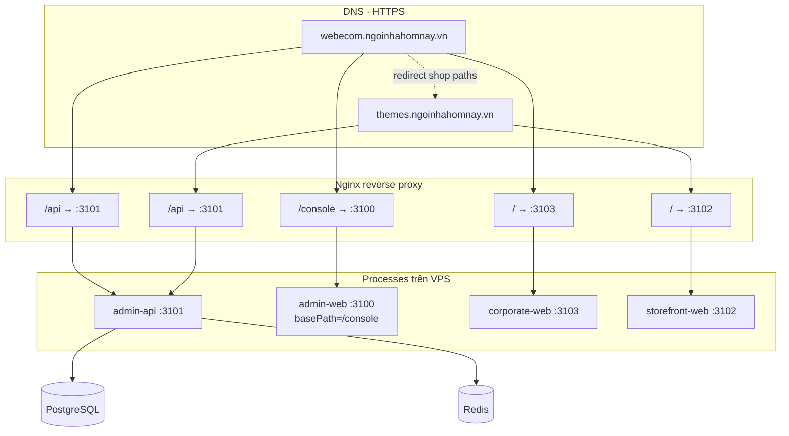
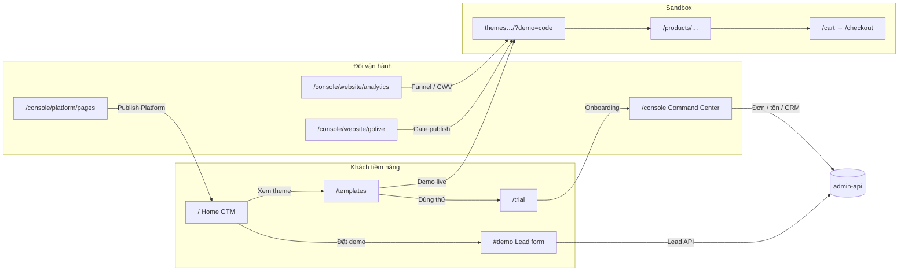

# Hướng dẫn sử dụng — PTT WebCom / Commerce Intelligence OS

| Thuộc tính | Nội dung |
|---|---|
| Phiên bản | 1.0 |
| Ngày | 2026-09-20 |
| Phạm vi | Toàn hệ thống WebCom đã deploy (Platform GTM · Storefront · Admin Console · API) |
| Đối tượng | PO, Sales, Marketing, CSKH, Ops, DevOps, Agency |
| Môi trường production | `webecom.ngoinhahomnay.vn` · `themes.ngoinhahomnay.vn` |

---

## 1. Hệ thống gồm những gì?

WebCom tách **ba mặt tiền** + **một API trung tâm**:

| Thành phần | Vai trò | Ai dùng |
|---|---|---|
| **Platform (Corporate GTM)** | Bán nền tảng PTT: narrative margin, catalog template, lead/demo/trial | Khách hàng tiềm năng, Sales, Marketing |
| **Storefront (Themes sandbox)** | Shop demo / merchant AURA — mua hàng thật trên sandbox | Shopper, merchant thử theme |
| **Admin Console** | Điều hành đơn · tồn · CRM · website · live · revenue | Chủ shop, CSKH, Ops, Editor CMS |
| **Admin API** | Backend chung (auth, catalog, CMS, analytics, leads…) | Các app gọi nội bộ |

```text
Người dùng web
    │
    ├─► webecom.ngoinhahomnay.vn/          → Platform GTM (corporate-web)
    ├─► webecom.ngoinhahomnay.vn/templates → Marketplace theme
    ├─► webecom.ngoinhahomnay.vn/console   → Admin Console (admin-web)
    ├─► webecom.ngoinhahomnay.vn/api       → Admin API
    └─► themes.ngoinhahomnay.vn            → Storefront demo (storefront-web)
```

---

## 2. Mô hình liên quan giữa các link

### 2.1. Sơ đồ domain & dịch vụ (production)



### 2.2. Luồng nghiệp vụ giữa các site



### 2.3. Bảng map link production ↔ app ↔ port

| Link công khai | App | Port nội bộ | Mô tả ngắn |
|---|---|---|---|
| `https://webecom.ngoinhahomnay.vn/` | corporate-web | 3103 | Homepage GTM — PTT margin narrative |
| `https://webecom.ngoinhahomnay.vn/templates` | corporate-web | 3103 | Catalog ThemePackage |
| `https://webecom.ngoinhahomnay.vn/trial` | corporate-web | 3103 | Self-serve trial |
| `https://webecom.ngoinhahomnay.vn/pricing` | corporate-web | 3103 | Bảng giá |
| `https://webecom.ngoinhahomnay.vn/en` | corporate-web | 3103 | Homepage EN |
| `https://webecom.ngoinhahomnay.vn/console` | admin-web | 3100 | Admin Console (cần đăng nhập) |
| `https://webecom.ngoinhahomnay.vn/api/...` | admin-api | 3101 | REST API |
| `https://themes.ngoinhahomnay.vn/` | storefront-web | 3102 | Shop AURA / demo package |
| `https://themes.ngoinhahomnay.vn/?demo=<code>` | storefront-web | 3102 | Preview ThemePackage theo code |
| `https://themes.ngoinhahomnay.vn/products/...` | storefront-web | 3102 | PDP |

> Trên apex, các path shop cũ (`/products`, `/cart`, …) **redirect 302** sang `themes.ngoinhahomnay.vn` cùng path.

### 2.4. Port local (dev)

| App | URL local | Port |
|---|---|---|
| admin-web | http://localhost:3000 | 3000 (không `/console` trừ khi set `NEXT_BASE_PATH`) |
| admin-api | http://localhost:3001 | 3001 |
| storefront-web | http://localhost:3002 | 3002 |
| corporate-web | http://localhost:3003 | 3003 |
| AI Gateway (optional) | http://localhost:3104 | 3104 |

---

## 3. Setup môi trường

### 3.1. Yêu cầu máy local

- Node.js **≥ 22**
- pnpm **9.15.4** (qua Corepack)
- Docker Desktop (Postgres, Redis, MinIO…)
- Git

### 3.2. Cài đặt local (lần đầu)

```bash
git clone https://github.com/nhaphuong240-max/WEBCOM.git
cd WEBCOM

cp .env.example .env
# chỉnh DATABASE_URL / JWT nếu cần — mặc định khớp docker-compose

pnpm install
docker compose up -d

pnpm --filter @ptt/shared-kernel build
pnpm --filter @ptt/ui build
pnpm --filter @ptt/themes build

pnpm --filter @ptt/admin-api exec prisma generate
pnpm --filter @ptt/admin-api exec prisma migrate deploy
pnpm --filter @ptt/admin-api exec prisma db seed

pnpm dev
```

Mở:

- Platform: http://localhost:3003  
- Storefront: http://localhost:3002  
- Admin: http://localhost:3000  
- API health: http://localhost:3001/api/health  

### 3.3. Tài khoản seed (dev / sau seed VPS)

| Email | Mật khẩu | Vai trò |
|---|---|---|
| `admin@aura.local` | `AuraAdmin1!` | Admin merchant AURA |
| `editor@webcom.local` | `PlatformCms1!` | Editor Platform CMS |
| `approver@webcom.local` | `PlatformCms1!` | Approver Platform CMS |

> Đổi mật khẩu trên môi trường thật. Không commit `.env`.

### 3.4. Feature flags quan trọng (`.env`)

| Flag | Mặc định | Ý nghĩa |
|---|---|---|
| `FEATURE_PLATFORM_CMS` | `false` | `true` = corporate đọc trang published từ CMS |
| `FEATURE_CMS_DEMO_PACKAGE` | `true` | `?demo=<code>` resolve ThemePackage |
| `FEATURE_CMS_PACKAGE_RESOLVE` | `true` | Resolve package catalog |
| `FEATURE_GOLIVE_GATE` | `true` | Chặn publish khi checklist fail |
| `FEATURE_ANALYTICS_CONSENT_GATE` | `true` | Pixel chỉ sau consent |
| `AUTH_DEV_BYPASS` | `true` (local) | Dev auth — **tắt trên production** |

Chi tiết đầy đủ: `.env.example`.

### 3.5. Deploy / cập nhật VPS

Thư mục: `/var/www/webecom` · user deploy · systemd `webecom-*`.

```bash
# Trên máy local (sau khi push main)
ssh -i ~/.ssh/nnhn_deploy root@ngoinhahomnay.vn 'bash -s' <<'REMOTE'
set -euo pipefail
cd /var/www/webecom
git fetch origin main && git pull --ff-only origin main
bash deploy/setup-vps.sh
set -a; source .env; set +a
pnpm --filter @ptt/admin-api exec prisma db seed
systemctl is-active webecom-admin-api webecom-admin-web webecom-storefront webecom-corporate
REMOTE
```

Runbook liên quan:

- [`docs/runbooks/platform-apex-demo.md`](./runbooks/platform-apex-demo.md) — DNS/SSL apex + themes  
- [`docs/runbooks/shared-cms.md`](./runbooks/shared-cms.md) — Shared CMS  
- [`docs/runbooks/platform-cms.md`](./runbooks/platform-cms.md) — Platform CMS corporate  
- [`deploy/setup-vps.sh`](../deploy/setup-vps.sh) — install / build / restart  

### 3.6. Stack phụ trợ (Docker Compose)

| Service | Port | Khi nào cần |
|---|---|---|
| Postgres 16 | 5432 | Bắt buộc |
| Redis 7 | 6379 | Bắt buộc |
| MinIO | 9000 / 9001 | Media |
| ClickHouse | 8123 | Profile `analytics` |
| Redpanda / Temporal / OpenSearch | theo compose | Profile nâng cao |

```bash
docker compose --profile analytics up -d
```

---

## 4. Platform GTM — từng màn hình (`corporate-web`)

Base: `https://webecom.ngoinhahomnay.vn` (local `:3003`).

| Path | Tên màn | Tính năng chính | CTA / hành động |
|---|---|---|---|
| `/` | Home GTM | Brand **PTT.**, hero margin, proof strip, tab Omnichannel (Web/Social/Live/POS/Sàn/DN), contrast GMV vs margin, Revenue Graph, CRM, AI, Ops, form **Đặt demo** | `#demo` lead · `/templates` · `/trial` |
| `/en` | Home EN | Cùng narrative tiếng Anh | Book demo |
| `/templates` | Template Marketplace | Lọc industry/goal/license, sort CVR, card theme, mở demo | Demo → themes host · Trial · Chi tiết |
| `/templates/[code]` | Theme detail | Manifest, score, reviews, CTA mua/trial/demo | `?demo=code` trên themes |
| `/trial` | Self-serve trial | Wizard dùng thử trước paywall | Tạo tenant / vào console |
| `/pricing` | Pricing | Gói Theme license vs Platform plan | Đặt demo · Trial |
| `/en/pricing` | Pricing EN | Bản Anh | Book demo |
| `/solutions/[module]` | Solution | Trang module (vd. website) | Templates / demo |
| `/industries/[slug]` | Industry | Playbook ngành (beauty…) | Templates ngành |
| `/case-studies` · `/case-studies/[slug]` | Case study | Case AURA / ROI narrative | Demo |
| `/resources` · `/resources/[slug]` | Resources | Checklist, gated content | Download / lead |
| `/tour` | Product tour | Tour Command Center / module | Đặt demo |
| `/#channels` `#crm` `#ai` `#ops` `#margin` `#demo` | Anchor Home | Điều hướng section GTM | Scroll |

**Lead form:** gửi `POST /api/v1/leads` → CRM routing (consent bắt buộc).

**CMS:** khi `FEATURE_PLATFORM_CMS=true`, nội dung `/` đọc từ Platform CMS (`/console/platform/pages`). Fallback hardcoded = `GtmHome` margin narrative.

---

## 5. Storefront — từng màn hình (`storefront-web`)

Base: `https://themes.ngoinhahomnay.vn` (local `:3002`).

| Path | Tên màn | Tính năng chính |
|---|---|---|
| `/` | Home shop | Hero bottle/plane (mockup 08), collection chips, lưới SP, trust COD/đổi trả/giao |
| `/?demo=<code>` | Demo package | Resolve ThemePackage (tokens + content) — không chỉ đổi metadata |
| `/products/[slug]` | PDP | Product plane, badge, giá thành viên, stock, trust 3 cột, Zalo/Messenger, mua kèm, sticky ATC |
| `/collections/[slug]` | Collection | Lọc SP theo BST |
| `/search` | Search | Tìm SP |
| `/cart` | Giỏ | Sửa qty, sang checkout |
| `/checkout` | Checkout | Ship quote, voucher, COD / QR stub, consent pixel |
| `/account` | Tài khoản | OTP/password (seed demo) |
| `/order/[id]` | Order status | Theo dõi đơn sau đặt |
| `/live` | Live (shopper) | Stub “sắp phát” + CTA xem SP — tab bottom nav |
| `/blog` · `/blog/[slug]` | Blog CMS | Bài viết storefront (flag blog) |
| `/p/[slug]` | CMS page | Trang nội dung ContentV1 |
| `/sitemap.xml` · `/robots.txt` | SEO | Sitemap / robots |

**Bottom nav (mobile):** Home · Search · Live (chấm đỏ) · Account · Cart.

**Analytics:** page_view / view_item / add_to_cart / begin_checkout / purchase → funnel Admin Analytics.

---

## 6. Admin Console — từng màn hình (`admin-web`)

Base production: `https://webecom.ngoinhahomnay.vn/console`  
Base local: `http://localhost:3000` (không prefix trừ khi set `NEXT_BASE_PATH=/console`).

Đăng nhập: `/login` (hoặc `/console/login`).

### 6.1. Điều hành

| Path (sau base) | Màn hình | Dùng để làm gì |
|---|---|---|
| `/` | **Command Center** | KPI contribution margin, exception queue (COD/tồn/publish/AI), AI HITL, channel GMV vs margin, đơn gần đây |
| `/products` | Sản phẩm | Catalog SKU, giá, media |
| `/orders` | Đơn hàng | Xử lý đơn, COD, trạng thái |
| `/customers` | Customers | Customer 360 list |
| `/customers/[id]` | Hồ sơ KH | Chi tiết + identity |
| `/customers/matches` | Identity matches | Merge / review trùng SĐT·email |
| `/segments` · `/segments/[id]` | Segments | Phân khúc RFM / rule |
| `/loyalty` · `/loyalty/[customerId]` | Loyalty | Điểm, hạng |
| `/journeys` · `/journeys/[id]` | Journeys | Automation (welcome, win-back…) |
| `/recovery` | Recovery | COD fail / task CSKH / AI chờ duyệt |
| `/inventory` | Tồn kho | Tồn, reservation, oversell risk |

### 6.2. Nhân sự / HRM

| Path | Màn hình | Tính năng |
|---|---|---|
| `/hr/users` | Users | Tài khoản IAM |
| `/hr/employees` | Employees | Hồ sơ nhân viên |
| `/hr/roles` | Roles | Role template / permission |
| `/hr/shifts` | Shifts | Ca làm |
| `/hr/sessions` | Login history | Phiên đăng nhập |
| `/hrm` … `/hrm/payroll` | HRM Pro | Phòng ban, HĐ, nghỉ, chấm công, lương (flag `FEATURE_HRM_PRO`) |

### 6.3. Website / Platform CMS

| Path | Màn hình | Tính năng |
|---|---|---|
| `/website/onboarding` | Onboarding | Brand Kit → theme match → go-live wizard |
| `/website/templates` | Template Store (admin) | Cài / chọn ThemePackage |
| `/website/themes` | Theme Library | Staging / publish / rollback |
| `/website/builder` | Site Builder | Canvas ContentV1, AI copy (guardrail) |
| `/website/settings` | Thiết lập website | Brand / Floating / **Bán hàng** / Popup (CMS Pro) |
| `/website/collections` | Bộ sưu tập merch | Banner + SEO collection (`collection--{slug}`) |
| `/website/nav` | Mega menu | Header mega: columns + collection + SP |
| `/website/campaigns` | Campaign promo | `landing_promo` · countdown TZ VN · coupon |
| `/website/leads` | Leads | Form tư vấn + CSV |
| `/platform/pages` | Platform CMS Pages | Soạn / duyệt / publish trang corporate |
| `/platform/nav` | Platform Nav | Header/footer nav theo site (`webcom_apex`, `webcom_en`…) |
| `/website/creator` | Creator Portal | Creator scorecard / portal |
| `/website/domains` | Domain / SSL | Gắn domain, TLS |
| `/website/golive` | Go-live Checklist | Gate Pixel / CWV — **chặn publish** khi fail |
| `/website/analytics` | Web Analytics | KPI sessions/CVR/contribution/AOV, funnel %, CWV LCP/INP/CLS, landing margin, experiments, AI assist |
| `/website/agency` | Agency / Headless | Multi-brand / headless |
| `/design-system` | Design system | Token / component preview |

### 6.4. Tăng trưởng & trí tuệ

| Path | Màn hình | Tính năng |
|---|---|---|
| `/social` · `/social/[id]` | Social Inbox | Inbox đa kênh, thread |
| `/live` | Live Commerce | Session live, keyword order, comment, start/end |
| `/marketplace` | Marketplace connectors | Sàn (Shopee…) sync stub |
| `/pos` | POS | Đồng bộ quầy |
| `/revenue` | Revenue Intelligence | Margin theo kênh / fee-aware P&L |

### 6.5. Auth phụ

| Path | Màn hình |
|---|---|
| `/login` | Đăng nhập email/password |
| `/auth/callback` | Nhận token sau login |
| `/invite/[token]` | Accept invite |

---

## 7. Hành trình dùng thường gặp

### 7.1. Sales / Marketing — săn lead

1. Mở `webecom…/` → kể chuyện margin.  
2. Khách xem `/templates` → bấm **Demo** → `themes…/?demo=beauty-glow`.  
3. Khách **Đặt demo** (`#demo`) hoặc `/trial`.  
4. Sales xem lead trong CRM / follow SLA.  
5. Editor chỉnh homepage tại `/console/platform/pages` → Approver publish.

### 7.2. Merchant — mở shop & bán

1. `/trial` hoặc `/console/website/onboarding`.  
2. Chọn theme → Brand Kit → Builder.  
3. `/console/website/settings?tab=commerce` — empty cart, mini-cart, policy, thank-you.  
4. `/console/website/collections` — banner/SEO BST → Publish.  
5. `/console/website/nav` — mega menu gắn collection/SP.  
6. (Tuỳ chọn) `/console/website/campaigns` — landing promo + countdown.  
7. `/console/website/golive` đạt checklist (kể cả commerce).  
8. Publish → khách: PLP → PDP → ATC → mini-cart → checkout trên storefront.  
9. Ops xử lý đơn `/console/orders`, tồn `/console/inventory`.  
10. Marketing theo funnel `/console/website/analytics`.

**Không nhầm:** sửa giá/tồn ở `/console/products` · `/inventory` — không phải trong Builder.

### 7.3. Live commerce

1. Admin `/console/live` tạo session + items.  
2. Start live → comment/keyword.  
3. Shopper mở `/live` trên themes (stub UI) hoặc theo link phiên.  
4. Đơn vào Command Center / Orders; theo dõi margin sau return.

### 7.4. Dev — demo ThemePackage

```text
https://themes.ngoinhahomnay.vn/?demo=<package-code>
# ví dụ: beauty-glow, bloom-kids, studio-agency
```

Catalog: `packages/themes/catalog/*/package.manifest.json` (mục tiêu **30/30**).

---

## 8. API công khai hay dùng

| Method | Path | Mục đích |
|---|---|---|
| GET | `/api/health` | Health check |
| GET | `/api/v1/public/templates` | Catalog theme public |
| GET | `/api/v1/public/templates/:code` | Chi tiết theme |
| POST | `/api/v1/leads` | Lead form corporate |
| * | `/api/v1/admin/...` | Admin (JWT) |
| * | `/api/v1/storefront/...` | Runtime shop |

OpenAPI theo phase: `docs/openapi-*.yaml` · Bruno: `docs/bruno/`.

---

## 9. Mockup UI ↔ màn hình production

| Mockup | File | Màn tương ứng |
|---|---|---|
| 01 | `mockups/01-corporate-gtm.html` | `/` corporate |
| 02 | `02-onboarding.html` | `/console/website/onboarding` |
| 03 | `03-admin-command-center.html` | `/console/` |
| 04 | `04-template-marketplace.html` | `/templates` · admin templates |
| 05–07 | Theme / Builder / Go-live | `/console/website/themes|builder|golive` |
| 08 | `08-storefront-beauty.html` | `themes…/` + PDP |
| 09 | `09-website-analytics.html` | `/console/website/analytics` |
| 10–12 | Social / Revenue / Creator | `/console/social|live|revenue|creator` |

Mở hub: [`mockups/index.html`](../mockups/index.html).

---

## 10. Xử lý sự cố nhanh

| Hiện tượng | Kiểm tra |
|---|---|
| Apex vẫn hiện shop cũ | Nginx `location /` phải trỏ `webecom_corporate`; xem runbook platform-apex |
| `?demo=` không đổi theme | `FEATURE_CMS_DEMO_PACKAGE` · seed catalog · code đúng manifest |
| Console 404 | Dùng `/console` (không bắt buộc trailing slash) · service `:3100` |
| Lead không vào | API `/api/v1/leads` · CORS/tenant header · consent checkbox |
| CWV chặn publish | `/console/website/golive` + Analytics CWV panel |
| Service down | `systemctl status webecom-*` · `journalctl -u webecom-admin-api -n 100` |

---

## 11. Tài liệu liên quan

| Tài liệu | Nội dung |
|---|---|
| [BA v5](./01_Phan_tich_Nghiep_vu_PTT_Commerce_Intelligence_OS_v5.md) | Nghiệp vụ / persona / KPI |
| [SRS v5.1](./02_SRS_Master_PTT_Commerce_Intelligence_OS_v5.md) | Yêu cầu chức năng |
| [Architecture v3](./03_Kien_truc_He_thong_va_Cong_nghe_PTT_Commerce_Intelligence_OS_v3.md) | Kiến trúc kỹ thuật |
| [Kế hoạch WebCom](./04_Ke_hoach_Trien_khai_WebCom_v1.md) | Phase W0–W5, roadmap |
| [README monorepo](../README.md) | Quick start dev |

---

## 12. Tóm tắt một trang

```text
BÁN NỀN TẢNG     webecom.ngoinhahomnay.vn          → corporate-web
ĐIỀU HÀNH        webecom.ngoinhahomnay.vn/console → admin-web
API              webecom.ngoinhahomnay.vn/api     → admin-api
BÁN HÀNG / DEMO  themes.ngoinhahomnay.vn          → storefront-web

Funnel: Home GTM → Templates → Demo themes → Trial/Console → Go-live → Analytics
Margin: Command Center + Revenue + Analytics landing contribution
```
